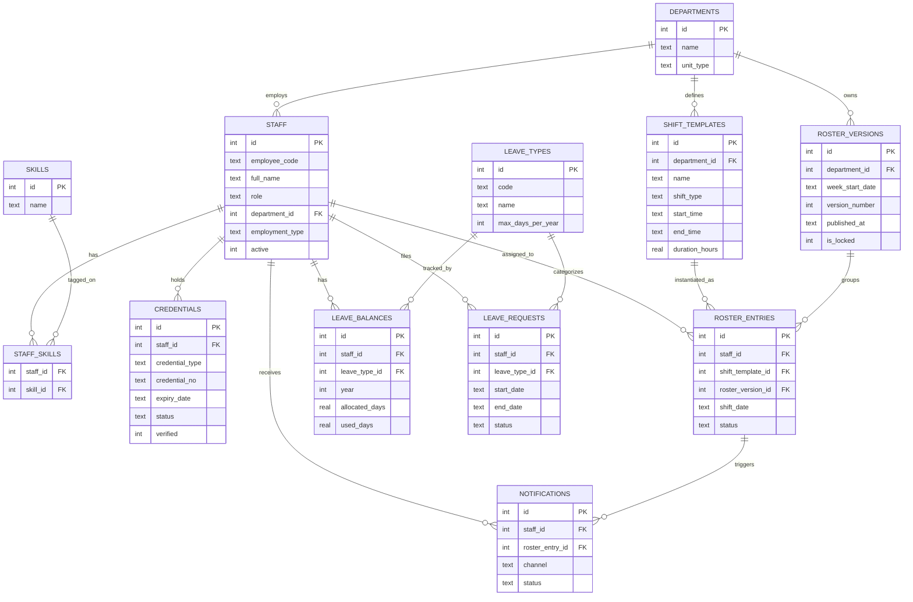

# PRD-06 — Phase-1 ERD

Scope: FR-1, FR-2, FR-3, FR-6, FR-14 only. Rules engine, solver, swap marketplace,
on-call trees, attendance, acuity-linking, resident-hours, NABH pack are Phase 2/3 — not modeled here.

## Design notes
- `roster_versions.is_locked = 1` after publish enforces the audit/immutability NFR — app-layer must reject writes to `roster_entries` once the parent version is locked (M2 stub: enforced in `POST /roster/versions/<id>/publish`, not yet enforced on entry edits — flag for M3).
- `credentials.status` is denormalized (computed nightly against `expiry_date` in production; for the MVP it's set at seed time and left static — no scheduler in the walking skeleton).
- Health-related `leave_requests.reason` masking from non-HR roles (DPDP requirement, §7 NFR) is an API-layer concern, not a schema concern — not implemented in M2, flagged for M3 auth work.
