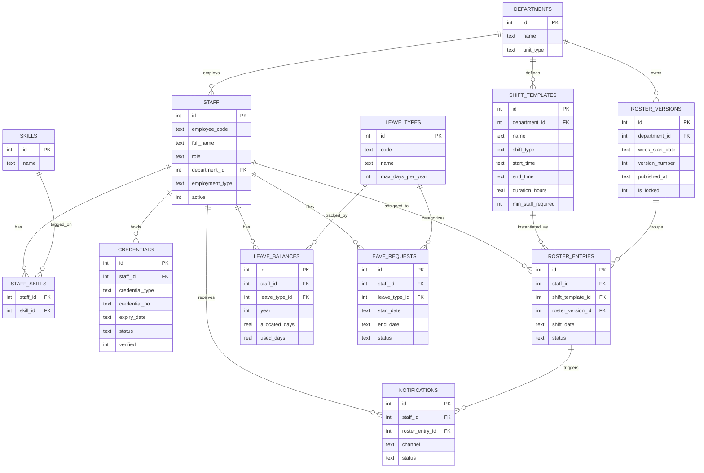

# M2 Design Lock  — PRD-06 Clinical Staff Scheduling & Duty Roster Management

> Milestone: M2 (Design freeze). Scope: Phase-1 (S-tier ●) only — FR-1, FR-2, FR-3, FR-6, FR-14.
>  SQLite DDL, wireframes, rule-check
> pseudocode (P6-specific requirement), seeded sample dataset, and a completed review log.


---

## 1. Purpose

Lock the screens, fields, roles, and rules for Phase-1 before build starts at M3, so nobody
is re-deciding UX mid-sprint. Anything not in this doc by the design-freeze gate is out of
scope for M3.

## 2. Personas in Scope (Phase 1)

| Persona | Touches |
|---|---|
| Nursing superintendent / dept head | Staff registry, shift templates, roster publish |
| Staff nurse / resident / technician / consultant | Own profile (read), leave requests, published roster (read) |
| HR manager | Credential registry, leave approvals |

*Out of scope for Phase 1*: medical superintendent (on-call trees), quality/NABH coordinator (ratio evidence), finance (overtime cost) — these attach to Phase 2/3 FRs.

## 3. Design Principles

- Hard blocks (expired credential, missing required field, ratio/rest-hour violation) stop the action; soft warnings (leave overlapping a published shift) inform but don't block.
- Every roster-facing screen distinguishes **draft** vs **published** state visually — staff must never see draft data.
- Mobile-first for staff-facing screens (leave request, roster view); desktop-first for registry/admin screens.

---

## 4. Entity Relationship Diagram




---

## 5. SQLite DDL — NEW

This is the actual runnable schema. Copy into `schema.sql` and run `sqlite3 roster.db < schema.sql`.

```sql
PRAGMA foreign_keys = ON;

CREATE TABLE departments (
    id INTEGER PRIMARY KEY AUTOINCREMENT,
    name TEXT NOT NULL UNIQUE,
    unit_type TEXT NOT NULL CHECK (unit_type IN ('general_ward','icu','ot','emergency','opd','other'))
);

CREATE TABLE staff (
    id INTEGER PRIMARY KEY AUTOINCREMENT,
    employee_code TEXT NOT NULL UNIQUE,
    full_name TEXT NOT NULL,
    role TEXT NOT NULL CHECK (role IN ('nurse','resident','technician','consultant','dept_head')),
    department_id INTEGER NOT NULL REFERENCES departments(id),
    employment_type TEXT NOT NULL DEFAULT 'permanent' CHECK (employment_type IN ('permanent','contract','locum')),
    active INTEGER NOT NULL DEFAULT 1 CHECK (active IN (0,1))
);

CREATE TABLE skills (
    id INTEGER PRIMARY KEY AUTOINCREMENT,
    name TEXT NOT NULL UNIQUE
);

CREATE TABLE staff_skills (
    staff_id INTEGER NOT NULL REFERENCES staff(id),
    skill_id INTEGER NOT NULL REFERENCES skills(id),
    PRIMARY KEY (staff_id, skill_id)
);

CREATE TABLE credentials (
    id INTEGER PRIMARY KEY AUTOINCREMENT,
    staff_id INTEGER NOT NULL REFERENCES staff(id),
    credential_type TEXT NOT NULL CHECK (credential_type IN
        ('nmc_registration','nursing_council','bls','acls','pharmacist_licence')),
    credential_no TEXT NOT NULL,
    expiry_date TEXT NOT NULL,               -- ISO 'YYYY-MM-DD'
    status TEXT NOT NULL DEFAULT 'valid' CHECK (status IN ('valid','expiring_soon','expired')),
    verified INTEGER NOT NULL DEFAULT 0 CHECK (verified IN (0,1))
);

CREATE TABLE shift_templates (
    id INTEGER PRIMARY KEY AUTOINCREMENT,
    department_id INTEGER NOT NULL REFERENCES departments(id),
    name TEXT NOT NULL,
    shift_type TEXT NOT NULL CHECK (shift_type IN ('morning','evening','night','on_call')),
    start_time TEXT NOT NULL,                -- 'HH:MM' 24hr
    end_time TEXT NOT NULL,
    duration_hours REAL NOT NULL,
    min_staff_required INTEGER NOT NULL DEFAULT 1
);

CREATE TABLE roster_versions (
    id INTEGER PRIMARY KEY AUTOINCREMENT,
    department_id INTEGER NOT NULL REFERENCES departments(id),
    week_start_date TEXT NOT NULL,           -- ISO date, Monday of the week
    version_number INTEGER NOT NULL,
    published_at TEXT,                       -- NULL until published
    is_locked INTEGER NOT NULL DEFAULT 0 CHECK (is_locked IN (0,1))
);

CREATE TABLE roster_entries (
    id INTEGER PRIMARY KEY AUTOINCREMENT,
    staff_id INTEGER NOT NULL REFERENCES staff(id),
    shift_template_id INTEGER NOT NULL REFERENCES shift_templates(id),
    roster_version_id INTEGER NOT NULL REFERENCES roster_versions(id),
    shift_date TEXT NOT NULL,                -- ISO date
    status TEXT NOT NULL DEFAULT 'assigned' CHECK (status IN ('assigned','cancelled'))
);

CREATE TABLE leave_types (
    id INTEGER PRIMARY KEY AUTOINCREMENT,
    code TEXT NOT NULL UNIQUE,               -- EL/CL/SL/ML
    name TEXT NOT NULL,
    max_days_per_year INTEGER NOT NULL
);

CREATE TABLE leave_balances (
    id INTEGER PRIMARY KEY AUTOINCREMENT,
    staff_id INTEGER NOT NULL REFERENCES staff(id),
    leave_type_id INTEGER NOT NULL REFERENCES leave_types(id),
    year INTEGER NOT NULL,
    allocated_days REAL NOT NULL,
    used_days REAL NOT NULL DEFAULT 0,
    UNIQUE (staff_id, leave_type_id, year)
);

CREATE TABLE leave_requests (
    id INTEGER PRIMARY KEY AUTOINCREMENT,
    staff_id INTEGER NOT NULL REFERENCES staff(id),
    leave_type_id INTEGER NOT NULL REFERENCES leave_types(id),
    start_date TEXT NOT NULL,
    end_date TEXT NOT NULL,
    reason TEXT,
    status TEXT NOT NULL DEFAULT 'pending' CHECK (status IN ('pending','approved','rejected'))
);

CREATE TABLE notifications (
    id INTEGER PRIMARY KEY AUTOINCREMENT,
    staff_id INTEGER NOT NULL REFERENCES staff(id),
    roster_entry_id INTEGER REFERENCES roster_entries(id),
    channel TEXT NOT NULL CHECK (channel IN ('app','whatsapp','sms')),
    status TEXT NOT NULL DEFAULT 'sent' CHECK (status IN ('sent','failed'))
);

CREATE INDEX idx_staff_department ON staff(department_id);
CREATE INDEX idx_credentials_staff ON credentials(staff_id);
CREATE INDEX idx_roster_entries_staff_date ON roster_entries(staff_id, shift_date);
CREATE INDEX idx_roster_entries_version ON roster_entries(roster_version_id);
```

---

## 6. Screen Wireframes — NEW

Five screens, one per FR in scope. Boxed layout, not styled — just structure and fields, per
M2's "main, empty, error, edit" state expectation. Each block below is one screen.

### 6.1 Staff Registry (FR-1) — Main + Add Staff (Desktop)

```
┌──────────────────────────────────────────────────────────────────┐
│ Staff Registry                                    [+ Add Staff]  │
├──────────────────────────────────────────────────────────────────┤
│ Filter: [Department ▾]  [Role ▾]  [Active only ☑]  Search: [___] │
├──────────────────────────────────────────────────────────────────┤
│ Emp Code │ Name          │ Role      │ Dept   │ Type      │ ● │  │
│ N-1042   │ A. Sharma     │ nurse     │ ICU    │ permanent │ ● │  │
│ N-1043   │ R. Iyer       │ resident  │ Gen.Wd │ contract  │ ● │  │
│ ...      │ ...           │ ...       │ ...    │ ...       │   │  │
└──────────────────────────────────────────────────────────────────┘

Add Staff (modal/panel):
┌──────────────────────────────┐
│ Employee code *  [________]  │
│ Full name *      [________]  │
│ Role *           [▾ select]  │
│ Department *     [▾ select]  │
│ Employment type  [▾ default: permanent] │
│ Phone / Email    [________]  │
│ Skills           [+ add tag] [ICU-trained ×] [dialysis ×] │
│                                │
│         [Cancel]   [Save]     │
└──────────────────────────────┘

Error state: Save disabled + inline red text under any of
employee_code / full_name / role / department if empty.
"Employee code already exists" if duplicate on submit (409).
```

### 6.2 Credential Registry (FR-2) — Staff Profile → Credentials Tab

```
┌──────────────────────────────────────────────────────────────────┐
│ A. Sharma — N-1042                     [Profile] [Credentials]▾ │
├──────────────────────────────────────────────────────────────────┤
│ Type            │ Number     │ Expiry     │ Status         │    │
│ BLS              │ BLS-88213 │ 2026-09-01 │ 🟢 valid       │[Edit]│
│ Nursing Council   │ NC-44210  │ 2026-08-01 │ 🟡 expiring-soon (54d) │[Edit]│
│ ACLS              │ AC-11029  │ 2026-06-30 │ 🔴 EXPIRED     │[Re-verify]│
│                                                                    │
│  ⚠ This staff member is ROSTER-BLOCKED due to 1 expired          │
│    mandatory credential.                                          │
│                                              [+ Add Credential]   │
└──────────────────────────────────────────────────────────────────┘

Add Credential (modal):
┌──────────────────────────────┐
│ Credential type * [▾ select] │
│ Credential no. *  [________] │
│ Issuing body      [________] │
│ Issue date        [________] │
│ Expiry date *     [________] │
│         [Cancel]   [Save]    │
└──────────────────────────────┘
```

### 6.3 Shift Templates (FR-3) — Department View

```
┌──────────────────────────────────────────────────────────────────┐
│ Shift Templates — ICU                          [+ New Template] │
├──────────────────────────────────────────────────────────────────┤
│ Name          │ Type    │ Start │ End   │ Duration │ Min staff  │
│ ICU Morning   │ morning │ 07:00 │ 15:00 │ 8h       │ 3          │
│ ICU Night     │ night   │ 22:00 │ 06:00 │ 8h       │ 2          │
└──────────────────────────────────────────────────────────────────┘

New Template (modal):
┌──────────────────────────────┐
│ Name *            [________] │
│ Shift type *      [▾ select] │
│ Start time *      [__:__]    │
│ End time *        [__:__]    │
│ Duration           auto-calculated: 8.0h │
│ Min staff required [___]     │
│         [Cancel]   [Save]    │
└──────────────────────────────┘

Empty state (new department, no templates yet):
"No shift templates for this department yet. [+ New Template]"
```

### 6.4 Leave Request (FR-6) — Staff Mobile View

```
┌───────────────────────┐
│ Apply for Leave    ✕  │
├───────────────────────┤
│ Leave type  [▾ EL ▾]  │
│ Balance: 8.0 / 12 days remaining this year │
│ Start date  [________]│
│ End date    [________]│
│ Reason      [________]│
│                        │
│ ⚠ These dates overlap │
│ your published shift  │
│ on 22 Jul (ICU Night) │
│                        │
│      [Submit Request] │
└───────────────────────┘

My Leave Requests:
┌───────────────────────┐
│ 18–20 Jul  EL  pending │
│ 02–02 Jun  SL  approved│
└───────────────────────┘
```

### 6.5 Roster Grid + Publish (FR-14) — Superintendent Desktop

```
┌────────────────────────────────────────────────────────────────────┐
│ Roster — ICU — Week of 20 Jul 2026            [DRAFT v2]           │
├────────────────────────────────────────────────────────────────────┤
│          │ Mon 20 │ Tue 21 │ Wed 22 │ Thu 23 │ Fri 24 │ Sat │ Sun  │
│ A.Sharma │ Morning│ Morning│  OFF   │ Night  │ Night  │ ... │ ...  │
│ R.Iyer   │ Night  │  OFF   │ Morning│ Morning│  OFF   │ ... │ ...  │
│ ...      │        │        │        │        │        │     │      │
├────────────────────────────────────────────────────────────────────┤
│ ⚠ Wed 22, Morning: 1 staff assigned, minimum 3 required (ratio)    │
│ ⚠ A.Sharma Wed→Thu: only 6h rest between shifts (min 8h required)  │
├────────────────────────────────────────────────────────────────────┤
│                                    [Save Draft]  [Publish Roster]  │
└────────────────────────────────────────────────────────────────────┘

Published state (read-only banner, staff view):
┌────────────────────────────────────────────────────────────────────┐
│ Roster — ICU — Week of 20 Jul 2026    [PUBLISHED — locked v2]      │
│ (grid identical, but no edit controls; staff see only their own row)│
└────────────────────────────────────────────────────────────────────┘
```

---

## 7. Field Dictionary (Phase 1)

| Screen | Field | Type | Required | Source | Validation |
|---|---|---|---|---|---|
| Staff Registry | Employee code | text | Yes | manual entry | unique |
| Staff Registry | Full name | text | Yes | manual entry | non-empty |
| Staff Registry | Role | enum | Yes | manual entry | nurse\|resident\|technician\|consultant\|dept_head |
| Staff Registry | Department | reference | Yes | departments table | must exist |
| Staff Registry | Employment type | enum | No (default: permanent) | manual entry | permanent\|contract\|locum |
| Credential Registry | Credential type | enum | Yes | manual entry | nmc_registration\|nursing_council\|bls\|acls\|pharmacist_licence |
| Credential Registry | Expiry date | date | Yes | manual entry | must be a valid future or past date |
| Shift Template | Shift type | enum | Yes | manual entry | morning\|evening\|night\|on_call |
| Shift Template | Start/end time | time | Yes | manual entry | end must differ from start |
| Shift Template | Min staff required *(NEW)* | integer | Yes (default 1) | manual entry | ≥ 1 |
| Leave Request | Leave type | reference | Yes | leave_types table | must exist |
| Leave Request | Date range | date | Yes | manual entry | end date ≥ start date |
| Roster Publish | Version status | enum | system-set | system | draft → published (one-way) |

---

## 8. Rule-Check Pseudocode — NEW (P6-required)

Two rules, per the milestone requirement ("one ratio rule + one hour-rule chosen"). Both run
as **hard stops** at `POST /roster/entries` — an entry that violates either rule is rejected,
matching the "Design Principles" hard-block policy in Section 3.

### 8.1 Ratio Rule — Minimum Staff Per Shift

Proxy for nurse:patient ratio. Phase 1 has no live census (that's FR-11, Phase 3), so this
checks the assigned headcount for a shift against the shift template's configured minimum.

```
FUNCTION check_ratio_rule(shift_template_id, shift_date, roster_version_id):
    template = GET shift_templates WHERE id = shift_template_id
    current_count = COUNT roster_entries
                    WHERE shift_template_id = shift_template_id
                      AND shift_date = shift_date
                      AND roster_version_id = roster_version_id
                      AND status = 'assigned'

    projected_count = current_count + 1   # the entry about to be added

    IF projected_count < template.min_staff_required:
        RETURN WARNING("Adding this entry still leaves the shift understaffed:
                         {projected_count}/{template.min_staff_required} assigned")
        # non-blocking — lets superintendent keep building a partial roster

    RETURN OK

# Separately, at PUBLISH time this becomes a hard stop:
FUNCTION check_ratio_rule_at_publish(roster_version_id):
    FOR EACH (shift_template_id, shift_date) IN roster_entries GROUPED BY shift/date
             WHERE roster_version_id = roster_version_id:
        template = GET shift_templates WHERE id = shift_template_id
        assigned_count = COUNT roster_entries WHERE ... AND status = 'assigned'
        IF assigned_count < template.min_staff_required:
            RETURN BLOCK("Cannot publish: {shift_date} {template.name} has
                           {assigned_count}/{template.min_staff_required} staff")
    RETURN OK
```

### 8.2 Hour Rule — Minimum Rest Between Shifts

```
FUNCTION check_rest_hour_rule(staff_id, shift_template_id, shift_date):
    MIN_REST_HOURS = 8

    new_shift = GET shift_templates WHERE id = shift_template_id
    new_start = combine(shift_date, new_shift.start_time)
    new_end   = combine(shift_date, new_shift.end_time)
    IF new_end <= new_start:                     # overnight shift
        new_end = new_end + 1 day

    # find this staff member's adjacent shifts (day before / after)
    adjacent_entries = GET roster_entries
                        JOIN shift_templates
                        WHERE staff_id = staff_id
                          AND shift_date IN (shift_date - 1, shift_date, shift_date + 1)
                          AND status = 'assigned'

    FOR EACH existing IN adjacent_entries:
        existing_start = combine(existing.shift_date, existing.template.start_time)
        existing_end   = combine(existing.shift_date, existing.template.end_time)
        IF existing_end <= existing_start:
            existing_end = existing_end + 1 day

        gap_hours = MIN(
            hours_between(existing_end, new_start),
            hours_between(new_end, existing_start)
        )

        IF gap_hours < MIN_REST_HOURS AND gap_hours >= 0:
            RETURN BLOCK("Only {gap_hours}h rest between shifts on
                           {existing.shift_date} and {shift_date};
                           minimum {MIN_REST_HOURS}h required")

    RETURN OK
```

### 8.3 Where These Plug Into the API

`POST /roster/entries` calls, in order:
1. Credential check (existing hard stop — expired mandatory credential blocks assignment)
2. `check_rest_hour_rule` — hard stop
3. `check_ratio_rule` — warning only at entry-time, escalates to hard stop in `POST /roster/versions/<id>/publish`

This mirrors the M4 demo script requirement: *"show rule violation warning (ratio/rest-hours)"* — rest-hours blocks immediately, ratio warns while building and blocks only at publish, which is the more realistic hospital workflow (you build a roster incrementally before every slot is filled).

---

## 9. Role-Action Matrix (Phase 1)

| Action | Nursing superintendent | Staff nurse/resident/tech | HR manager | Dept head |
|---|:---:|:---:|:---:|:---:|
| Create/edit staff record | Y | — | Y | Y |
| Add/verify credential | — | — | Y | — |
| Create shift template | — | — | — | Y |
| File leave request | — | Y | — | — |
| Approve/reject leave | — | — | Y | Y |
| Publish/lock roster | Y | — | — | Y |
| View own published roster | — | Y | — | — |

---

## 10. Validation Rules Sheet

- **Save rules**: staff record can't save without employee code + department; credential can't save without expiry date; roster entry can't save if the parent version is locked.
- **Conflict rules**: no two roster entries for the same staff member on the same date + overlapping time window.
- **Hard stops**: expired mandatory credential blocks new roster assignment; rest-hour rule (<8h gap) blocks new roster assignment; publishing a version sets `is_locked=1` — no further writes permitted to that version's entries; publish blocked if any shift is under its `min_staff_required`.

---

## 11. Exception-State Sheet

| Exception | Trigger | Behaviour |
|---|---|---|
| Expired credential | `credentials.status = 'expired'` for a mandatory credential type | Staff member cannot be added to a new roster entry until renewed |
| Duplicate employee code | `POST /staff` with an existing `employee_code` | `409` — save rejected, message shown inline |
| Roster version locked | Write attempted against a version with `is_locked=1` | `403` — edits rejected, "this roster has been published and is locked" |
| Missing required field | Any create/edit form submitted incomplete | `400` — inline field-level error, form does not submit |
| Leave overlaps published shift | Leave request dates intersect a published roster entry | Soft warning shown to approver, not a block |
| Rest-hour violation *(NEW)* | New roster entry <8h gap from an adjacent shift for that staff member | `409` — entry rejected, "only Xh rest, minimum 8h required" |
| Understaffed shift at publish *(NEW)* | Shift's assigned count < `min_staff_required` at publish time | `409` — publish blocked, lists every under-minimum shift |

---

## 12. Seeded Sample Dataset — NEW

Minimal but realistic seed data — enough to demo all 5 Phase-1 flows plus trigger both rule
violations live in the M4 demo.

```sql
INSERT INTO departments (name, unit_type) VALUES
    ('ICU', 'icu'),
    ('General Ward', 'general_ward');

INSERT INTO skills (name) VALUES
    ('ICU-trained'), ('dialysis'), ('scrub');

INSERT INTO staff (employee_code, full_name, role, department_id, employment_type) VALUES
    ('N-1042', 'A. Sharma', 'nurse', 1, 'permanent'),
    ('N-1043', 'R. Iyer',   'nurse', 1, 'permanent'),
    ('N-1044', 'K. Nair',   'nurse', 1, 'contract'),
    ('N-2001', 'P. Verma',  'nurse', 2, 'permanent');

INSERT INTO staff_skills (staff_id, skill_id) VALUES (1, 1), (2, 1), (3, 2);

INSERT INTO credentials (staff_id, credential_type, credential_no, expiry_date, status, verified) VALUES
    (1, 'bls',  'BLS-88213', '2026-09-01', 'valid',   1),
    (1, 'acls', 'AC-11029',  '2026-06-30', 'expired', 1),   -- deliberately expired for demo
    (2, 'bls',  'BLS-88214', '2026-08-05', 'expiring_soon', 1);

INSERT INTO shift_templates (department_id, name, shift_type, start_time, end_time, duration_hours, min_staff_required) VALUES
    (1, 'ICU Morning', 'morning', '07:00', '15:00', 8.0, 3),  -- deliberately needs 3, only seed 1
    (1, 'ICU Night',   'night',   '22:00', '06:00', 8.0, 2);

INSERT INTO leave_types (code, name, max_days_per_year) VALUES
    ('EL', 'Earned Leave', 21),
    ('CL', 'Casual Leave', 12),
    ('SL', 'Sick Leave', 12),
    ('ML', 'Maternity Leave', 182);

INSERT INTO leave_balances (staff_id, leave_type_id, year, allocated_days, used_days) VALUES
    (1, 1, 2026, 21, 13), (1, 2, 2026, 12, 4);

INSERT INTO roster_versions (department_id, week_start_date, version_number, is_locked) VALUES
    (1, '2026-07-20', 1, 0);

-- One entry, deliberately under min_staff_required (3) for ICU Morning — triggers ratio warning
INSERT INTO roster_entries (staff_id, shift_template_id, roster_version_id, shift_date, status) VALUES
    (1, 1, 1, '2026-07-22', 'assigned');

-- A.Sharma also on ICU Night the next calendar slot, only 6h gap — triggers rest-hour block on attempt
-- (used live in demo: attempting this INSERT via the API should be REJECTED, not pre-seeded)
```

---

## 13. Walking-Skeleton Status (from `API_ROUTES.md`)

**M2 exit criteria met**: app boots, `/health` responds, and the Staff Registry flow
(`POST /staff` → `GET /staff` → `GET /staff/<id>`) runs end-to-end against seeded SQLite data.
All other Phase-1 routes are documented and stubbed (`501`), giving M3 a fixed contract to
build against. Full route table is unchanged — see `API_ROUTES.md`.

**M3 build order recommendation** (so rule-checks have something to run against):
1. Credentials (needed before roster entries can check credential status)
2. Shift templates (needed before roster entries can exist at all)
3. Roster entries + both rule checks from Section 8
4. Leave requests
5. Notifications

---

## 14. Review Log

| Date | Reviewer | Comment | Decision |
|---|---|---|---|
| 14 Jul 2026 | [team lead — fill in name] | Reviewed ERD, DDL, wireframes, rule pseudocode, seed data against milestone doc M2 checklist. All 6 originally-missing items (DDL, wireframes, seed data, rule pseudocode) now present. | Approved for M3 build |
| — | [sir / reviewer — fill in] | *(pending sir's review)* | — |
